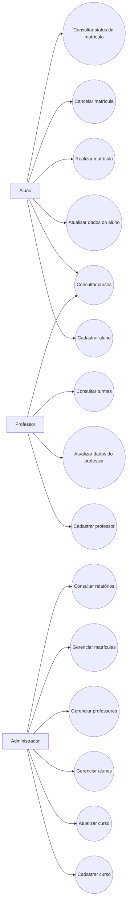

# 🎯 Diagrama de Casos de Uso — Sistema Acadêmico

## 📌 1. Objetivo

Este documento apresenta o diagrama de casos de uso do Sistema Acadêmico, representando as interações entre os atores do sistema e suas principais funcionalidades.

---

## 👥 2. Atores do Sistema

- **Aluno**
- **Professor**
- **Administrador**

---

## 📋 3. Casos de Uso Identificados

### Aluno
- Cadastrar-se
- Atualizar dados
- Consultar cursos
- Realizar matrícula
- Cancelar matrícula
- Consultar status da matrícula

### Professor
- Cadastrar-se
- Atualizar dados
- Consultar cursos
- Consultar turmas

### Administrador
- Gerenciar alunos
- Gerenciar professores
- Gerenciar cursos
- Gerenciar matrículas
- Consultar relatórios

---

## 🖼️ 4. Diagrama de Casos de Uso

## 🧠 5. Interpretação do Diagrama

O diagrama mostra como cada ator interage com o sistema:

- O Aluno possui funcionalidades voltadas ao seu cadastro e participação nos cursos.
- O Professor acessa funções relacionadas aos seus dados e turmas.
- O Administrador possui controle total sobre os cadastros, cursos, matrículas e relatórios.

## ✅ 6. Considerações Finais

O diagrama de casos de uso facilita a visualização das responsabilidades de cada perfil dentro do sistema e serve como base para a implementação das funcionalidades.