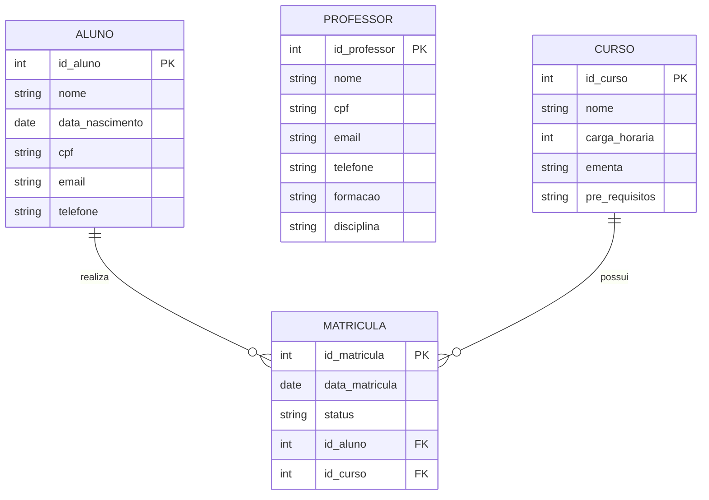

# 🗄️ Diagrama ER — Sistema Acadêmico

## 📌 1. Objetivo

Este documento apresenta o Diagrama Entidade-Relacionamento (ER) do Sistema Acadêmico, com foco nas principais entidades envolvidas no gerenciamento de alunos, professores, cursos e matrículas.

## 🧱 2. Entidades Principais

As entidades identificadas com base nos requisitos são:

- **Aluno**
- **Professor**
- **Curso**
- **Matrícula**

## 📝 3. Descrição das Entidades

### Aluno
Representa os estudantes cadastrados no sistema.

**Atributos sugeridos:**
- id_aluno
- nome
- data_nascimento
- cpf
- email
- telefone

### Professor
Representa os professores cadastrados.

**Atributos sugeridos:**
- id_professor
- nome
- cpf
- email
- telefone
- formacao
- disciplina

### Curso
Representa os cursos oferecidos pela instituição.

**Atributos sugeridos:**
- id_curso
- nome
- carga_horaria
- ementa
- pre_requisitos

### Matrícula
Representa o vínculo entre aluno e curso.

**Atributos sugeridos:**
- id_matricula
- data_matricula
- status
- id_aluno
- id_curso

## 🔗 4. Relacionamentos

- Um **Aluno** pode possuir várias **Matrículas**
- Um **Curso** pode possuir várias **Matrículas**
- Uma **Matrícula** pertence a um único **Aluno**
- Uma **Matrícula** pertence a um único **Curso**

## 🖼️ 5. Diagrama ER

## 🧠 6. Interpretação do Diagrama

O relacionamento principal do sistema está concentrado na entidade Matrícula, que faz a ligação entre Aluno e Curso.

Isso permite que:

- um aluno se matricule em vários cursos;
- um curso tenha vários alunos matriculados;
- o sistema registre histórico e status das matrículas.

A entidade Professor aparece como cadastro independente no escopo atual, podendo futuramente ser relacionada a turmas ou cursos.

## ✅ 7. Considerações Finais

O diagrama ER fornece a base estrutural para criação do banco de dados do sistema, ajudando a garantir integridade, organização e escalabilidade das informações acadêmicas.