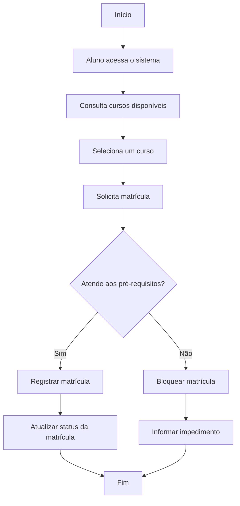

# 🔄 Diagrama de Fluxo — Sistema Acadêmico

## 📌 1. Objetivo

Este documento apresenta o diagrama de fluxo do Sistema Acadêmico, com foco no processo de matrícula em cursos, uma das funcionalidades centrais do sistema.

## 🧠 2. Fluxo Escolhido

O fluxo abaixo representa o processo em que um aluno:

- acessa o sistema
- consulta os cursos disponíveis
- seleciona um curso
- solicita matrícula
- passa pela verificação de pré-requisitos
- tem a matrícula aprovada ou bloqueada

## 🖼️ 3. Diagrama de Fluxo da Matrícula

